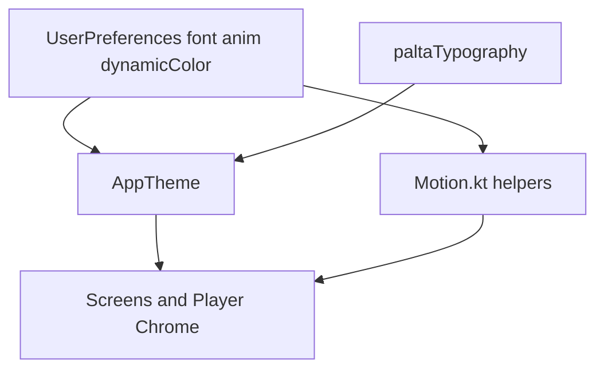

# Requirements

### Overview & Goals

Ejecutar el **pass de UI Material 3 Expressive** (opción **A**) empezando por su núcleo de mayor ROI (opción **B**): **tipografía Emphasized real + motion unificado** en toda la app de escritorio, sin nuevas features de producto (sin offset de letras, prefetch, refactor de `PlayerViewModel`, etc.).

Objetivo de sensación: que PaltaSound se lea menos como “M3 clásico + media player custom” y más como **M3E con jerarquía tipográfica y movimiento coherente**, respetando siempre `LocalAnimationsEnabled` / preferencia de reducir animaciones.

### Scope

#### In Scope
- Reactivar y afinar la escala tipográfica en `Type.kt` (hoy comentada) y cablearla en `AppTheme`.
- Exponer y usar de forma sistemática estilos `*Emphasized` donde hay jerarquía visual (títulos de pantalla, Now Playing, headers de Settings, CTAs primarios).
- Ampliar `Motion.kt` como **única fuente** de specs de animación UI (springs + fades + helper con/sin animaciones).
- Sustituir `tween(220/300/…)` ad hoc en superficies de alto tráfico por helpers del motion scheme.
- Pass visual en chrome de player (mini player + now playing transport/seek) alineado a shapes/motion M3E, sin cambiar lógica de playback.
- Crossfade suave del `ColorScheme` dinámico al cambiar artwork (solo UI/theme).
- Empty/loading copy tipográfica alineada al mismo lenguaje en pantallas tocadas.

#### Out of Scope
- Features nuevas (lyrics offset, prefetch, Listen Together UX, offline badges, shared-element extra).
- Refactor de `PlayerViewModel` / naming del producto.
- Cambiar fuente por defecto a algo distinto de Roboto empaquetada (el selector de fuente del usuario se mantiene).
- Rediseño total de cada settings sub-screen o del overlay Steam-like.
- Tests instrumentados de UI (solo compile + checklist manual).

### User Stories

- Como usuario, quiero **títulos y metadatos de canción más expresivos** para leer jerarquía al instante en Home / Now Playing / Mini player.
- Como usuario con animaciones on, quiero **transiciones suaves y consistentes** (nav, mini player, tabs, listas) sin saltos de duración distintos en cada pantalla.
- Como usuario con animaciones off, quiero que **todo el pass respete snap** y no deje springs residuales.
- Como usuario con color dinámico, quiero que el tema **no “parpadee”** al cambiar de canción.

### Functional Requirements

1. `MaterialTheme.typography` incluye escala afinada + variantes Emphasized con la `FontFamily` activa (Roboto o custom).
2. Pantallas clave usan Emphasized (o tokens de la nueva escala) en lugar de `FontWeight.SemiBold`/`Bold` manual donde sea el título principal.
3. Código de UI de alto tráfico importa specs desde `Motion.kt` (p. ej. `expressiveSpring()`, `interactionSpring()`, `expressiveFadeTween()`, y un `motionSpec()` / `animate*AsState` helper que aplique `snap()` si animaciones off).
4. Mini player y Now Playing: tipografía + motion del chrome actualizados; play/seek/transporte con formas de `AppShapes` y springs de interacción.
5. Al cambiar seed de artwork, colores del scheme interpolan o crossfadean de forma perceptible pero breve.
6. Build `:desktopApp:compileKotlin` en verde.

### Non-Functional Requirements

- Sin regresión de rendimiento notable en scroll de listas (evitar animar propiedades caras en cada item de grid masivo; priorizar headers y estados de selección).
- Compatibilidad con preferencias existentes (`selectedFont`, `dynamicColorFromArtwork`, layout modes).
- Cambios solo en `desktopApp` UI/theme (salvo que un token compartido sea estrictamente necesario; por defecto no tocar `shared`).

# Technical Design

### Current Implementation

 Área | Estado |
---|---|
 `Theme.kt` | `Typography().withFontFamily(family)` copia **todos** los `*Emphasized` pero **sin retocar pesos/tamaños**; default M3. |
 `Type.kt` | Escala “music player” **enteramente comentada**; no se usa. |
 `Fonts.kt` | `robotoFamily()` + `systemFontFamily` activos. |
 `Motion.kt` | Solo `expressiveSpring()`, `interactionSpring()`, `expressiveFadeDuration` (220), `expressiveFadeTween()`. |
 Uso real | Muchos `tween(220/300)`, springs locales (p. ej. letras), y tipografía `title*`/`body*` + `FontWeight` manual en Home, Account, MiniPlayer, Now Playing, Settings. |
 Shapes | `AppShapes` ya es escala Expressive (4→28 dp). |

Referencias previas de motion “bien hechas”: `NavigationStyles.kt`, partes de `MiniPlayer.kt`. Letras ya usan spring propio (no reabrir lógica de sync).

### Key Decisions

1. **Type scale en `Type.kt` reactivada y composable/no-composable pura**  
   Función `paltaTypography(fontFamily: FontFamily): Typography` (nombre alineado al producto o `appTypography`) que parta de `Typography()` default M3E y ajuste display/headline/title/label + **emphasized** (más contraste de peso/tamaño, tracking ligeramente negativo en headlines). Rationale: un solo sitio para personalidad tipográfica; `AppTheme` solo aplica family + scale.

2. **Motion scheme por helpers, no por MotionScheme de Android**  
   Compose Multiplatform desktop no tiene el mismo wiring de `MotionScheme` que Android 15; se **documenta y centraliza** en `Motion.kt` con:
   - springs existentes (posible micro-tune damping),
   - `expressiveTween(duration)` / fades,
   - `fun <T> uiSpring(animationsEnabled: Boolean)` → spring o `snap()`,
   - opcional `fun <T> uiTween(...)`.  
   Rationale: cero dependencia nueva; encaja con `LocalAnimationsEnabled`.

3. **Aplicación tipográfica por capas, no search-replace ciego**  
   - Capa 1: theme.  
   - Capa 2: componentes de alto impacto (MiniPlayer, Now Playing layouts/overlay, nav labels ya expresivos).  
   - Capa 3: títulos de `Home` / Library / Search / Settings section headers / Account.  
   Evitar tocar cada `Text` de metadata secundaria.

4. **Crossfade de color en `AppTheme`**  
   Animar interpolación de seeds o del scheme visible con duración ~expressive fade cuando cambian `seeds` y animaciones on; si off, snap. Rationale: cierra el “parpadeo” M3 dinámico sin tocar player.

5. **Player chrome visual-only**  
   Ajustar shapes (pill play), state layers hover ya existentes, y `animate*AsState` specs; no cambiar contratos de `PlayerViewModel`.

### Proposed Changes

#### 1. Foundation — tipografía
- Reescribir `desktopApp/.../ui/themes/Type.kt` activo.
- En `Theme.kt`: `typography = remember(fontFamily) { paltaTypography(fontFamily) }` (Emphasized ya incluidos en el builder).
- Opcional: extension/helpers de lectura `Typography.screenTitle` → `headlineMediumEmphasized` para no repetir nombres largos en UI (solo si reduce ruido).

#### 2. Foundation — motion
- Ampliar `Motion.kt` con API estable y KDoc de cuándo usar cada spec.
- Añadir bridge con `LocalAnimationsEnabled` (helper composable en el mismo package o `utils`) para no copiar `if (animationsEnabled) spring else snap` en cada call site.

#### 3. Call sites motion (prioridad)
- `MiniPlayer.kt`, `Navigation.kt` / `NavigationStyles.kt`
- `NowPlayingLayouts.kt`, `NowPlayingOverlay.kt`, `CoverArt.kt`
- `SyncedLyricsView.kt` (alinear al helper global **sin** revertir el scroll suave ya entregado)
- `SnackBar.kt`, dialogs ligeros, shimmer si usa tween fijo
- No reescribir animaciones de equalizer “ornamentales” salvo inconsistencia grosera

#### 4. Call sites tipografía (prioridad)
- Títulos de canción / artista en MiniPlayer y Now Playing → `titleLargeEmphasized` / `titleMedium` según jerarquía
- Headers de pantalla (Home, Library, Search, Settings root, Account)
- Labels de acciones primarias → `labelLargeEmphasized` donde haya CTA texto

#### 5. Theme color bloom
- En `AppTheme`, animar transición de `colorScheme` (lerp por roles clave o seeds + regenerate) al cambiar artwork/palette.

#### 6. Player chrome Expressive (cierre del pass A corto)
- Play button más pill (`AppShapes.extraLarge` / circular soft)
- Seek/sliders: thumb/track con motion `interactionSpring`
- Transporte: tamaños y tonal containers coherentes con M3E sin rediseñar layout islands

### File Structure

**Modificar**
- `desktopApp/src/main/kotlin/example/nucleus/ui/themes/Type.kt`
- `desktopApp/src/main/kotlin/example/nucleus/ui/themes/Motion.kt`
- `desktopApp/src/main/kotlin/example/nucleus/ui/themes/Theme.kt`
- `desktopApp/.../ui/components/MiniPlayer.kt`
- `desktopApp/.../ui/components/player/NowPlayingLayouts.kt` (+ overlay/cover según necesidad)
- `desktopApp/.../navigation/NavigationStyles.kt` / `Navigation.kt`
- Pantallas: `Home*` / library/search/settings entry points que definan el título principal (localizar por `typography.title` / headers al implementar)
- Posible `SlimSliders.kt` para seek M3E

**No tocar (salvo compile)**
- `shared` player/lyrics fetch
- empaquetado GraalVM / Nucleus bootstrap

### Architecture Diagram

### Risks

 Riesgo | Mitigación |
---|---|
 Emphasized demasiado grande en desktop denso | Ajustar sp de scale pensando en ventana 1280+, no mobile defaults a ciegas |
 Animar ColorScheme completo caro | Limitar a seeds o subset de roles; duration corta; skip si mismo seed |
 Diff enorme por replace masivo de tween | Priorizar archivos de alto tráfico; dejar tween en bordes |
 Regresión reduce-motion | Helper único obligatorio en código nuevo del pass |

# Testing

### Validation Approach

- Compilación `:desktopApp:compileKotlin`.
- Checklist manual en runtime (`:desktopApp:run`) con animaciones on/off y fuente default + una custom.

### Key Scenarios

1. Home / Library / Search: títulos se ven más emphatic; sin overflow grave en español.
2. Reproducir canción: MiniPlayer y Now Playing muestran jerarquía título/artista clara.
3. Cambiar de pista con dynamic color: transición de acento suave, no flash duro.
4. Abrir Now Playing / cambiar tabs: motion consistente con nav rail.
5. Desactivar animaciones en settings: snaps inmediatos en mini player, nav, letras, theme.

### Edge Cases

- Artwork ausente / `ArtworkColors.Default` (no animación espuria infinita).
- Layout `ISLANDS` vs `ATTACHED` (tipografía no rompe padding).
- Letras sincronizadas: scroll suave previo intacto; solo specs alineados.

### Test Changes

- No se añaden tests automatizados de UI en este pass.

# Delivery Steps

### ✓ Step 1: Foundation: Type scale + Motion scheme
La app tiene tipografía Palta/M3E cableada en AppTheme y una API de motion única con soporte reduce-motion.

- Reactivar y definir `paltaTypography` (o `appTypography`) en `Type.kt` con escala desktop y copias `*Emphasized` ajustadas.
- Cablear la escala en `Theme.kt` junto a `withFontFamily` / family del usuario.
- Ampliar `Motion.kt`: helpers `uiSpring` / `uiTween` / fades documentados; alinear damping con uso actual de nav/mini player.
- Añadir helper composable ligero que lea `LocalAnimationsEnabled` para no repetir branches.
- Verificar que compile el módulo theme sin tocar pantallas aún.

### ✓ Step 2: Apply Emphasized type on high-impact surfaces
Títulos y jerarquía principal de player + pantallas raíz usan estilos Emphasized/tokens nuevos.

- Actualizar MiniPlayer (título/artista) y Now Playing layouts/overlay.
- Actualizar headers de Home, Library, Search, Account y Settings root (archivos concretos localizados en implementación).
- Sustituir `FontWeight` manual en esos títulos cuando el estilo del theme ya aporta el peso.
- Revisar labels de CTAs primarios obvios (`label*Emphasized`) sin reescribir toda la app.

### ✓ Step 3: Unify motion on navigation, mini player, and player UI
Nav, mini player, now playing y componentes de player de alto tráfico comparten specs de Motion.kt.

- Reemplazar `tween`/`spring` locales en `MiniPlayer.kt`, `Navigation.kt` / `NavigationStyles.kt`, `NowPlayingLayouts.kt`, `CoverArt.kt`, snackbars/dialogs tocados de paso.
- Alinear `SyncedLyricsView` al helper global manteniendo scroll 520ms/suave ya entregado.
- Ajustar `SlimSliders` / controles de transporte visualmente (shapes + interaction spring) sin cambiar ViewModel.
- Pasar checklist reduce-motion on/off en estos flujos.

### ✓ Step 4: Dynamic color crossfade + Expressive chrome polish
El scheme dinámico transiciona al cambiar artwork y el chrome del player cierra el pass Expressive visual.

- Implementar interpolación/crossfade de seeds o roles de color en `AppTheme` con duración expressive y snap si animaciones off.
- Pulir botón play / seek / transporte (formas `AppShapes`, contenedores tonales) en mini + now playing.
- Repaso visual rápido empty/loading copy en pantallas ya tocadas.
- `./gradlew :desktopApp:compileKotlin` y checklist manual final del pass A+B.

### ✓ Step 5: Runtime polish — lyrics chrome + smoother motion
Quitar offset UI de letras en vista, motion sin rebote y seguir UX M3E.

- Remover barra ±0.5s de LyricsTab (offset solo en Settings).
- Retocar springs a easing más suave (sin overshoot).
- Checklist compile + mejoras Expressive residuales.